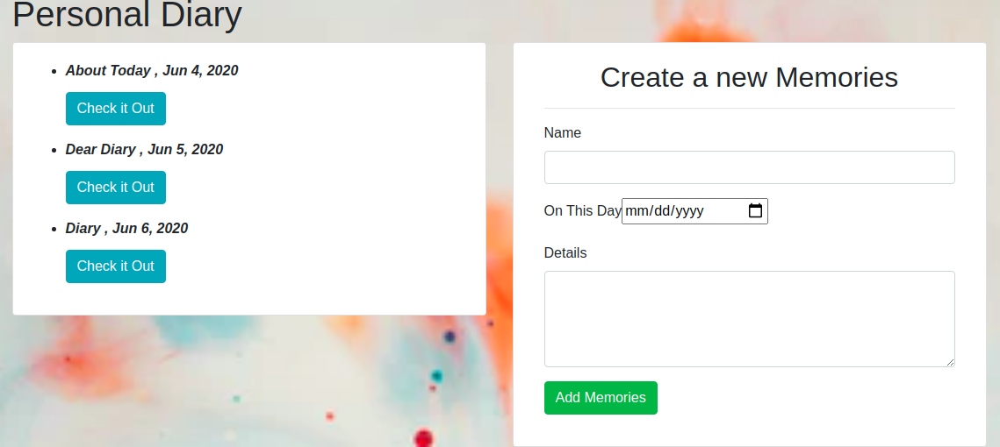

# Diary

## By Cecilia Barasa, 2020.

## Description
A diary application where the user can type in his/her thoughts and decide whether to delete or not after completion

This project was generated with [Angular CLI](https://github.com/angular/angular-cli) version 9.1.3.

## Setup/Installation Requirements
`Google Chrome`

Run `ng serve` for a dev server. Navigate to `http://localhost:4200/`. The app will automatically reload if you change any of the source files.

## Live Site

## Technoogies used

* `HTML`
* `TYPESCRIPT`
* `CSS`
* `MARKDOWN`
* `BOOTSTRAP`

## [Support and Contact Details](https://www.linkedin.com/in/cecilia-barasa-4a8311195/)

## [LICENSE]
